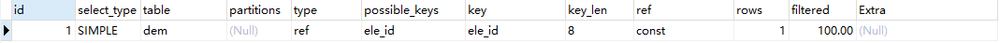
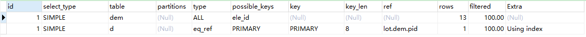
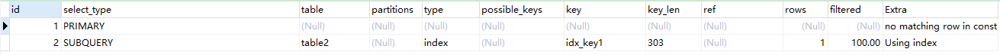
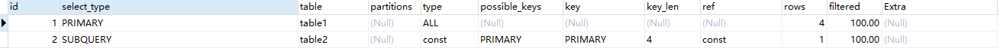
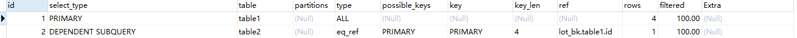
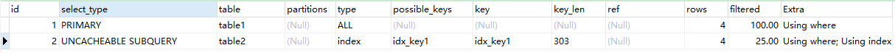
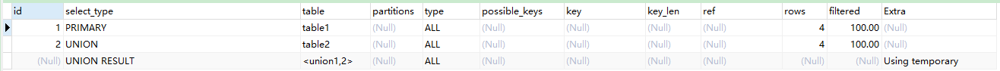
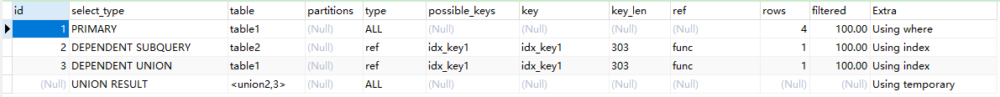
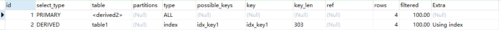

# MySQL Explain详解

## 前言

在工作中，排查慢的sql，常常用到explain这个命令来查看一个这些SQL语句的执行计划，查看该SQL语句有没有使用上了索引，有没有做全表扫描，这都可以通过explain命令来查看。所以我们深入了解MySQL的基于开销的优化器，还可以获得很多可能被优化器考虑到的访问策略的细节。

## 使用方法介绍

sql：

```sql
-- 普通查询
SELECT * FROM table1 t1
-- explain查询sql执行计划
explain SELECT * FROM table1 dem
```

explain结果：




## 字段详解

### id：

选择标识符，**SQL执行的顺序的标识，SQL从大到小的执行id相同时，执行顺序由上至下**（id如果相同，可以认为是一组，从上往下顺序执行；在所有组中，id值越大，优先级越高，越先执行）

```sql
explain SELECT * FROM table1 dem WHERE dem.pid IN (SELECT id FROM table2 d)
```



### select_type：

查询中每个select的类型，有以下几种类型：

1. SIMPLE(简单SELECT，不使用UNION或子查询等) 

```sql
explain SELECT * FROM table2 dem WHERE pid = 1
```


2. PRIMARY(查询中若包含任何复杂的字查询，最外层查询则标记为主查询)

```sql
explain SELECT * FROM table1 WHERE key1 = (SELECT key1 FROM table2) 
```



3. SUBQUERY（在select或where中包含子查询，结果不依赖于外部查询）

```sql
explain SELECT *,(select key1 FROM table2 WHERE id = 2) t2k FROM table1
```



4. DEPENDENT SUBQUERY（在select或where中包含子查询，结果依赖于外部查询）

```sql
explain SELECT *,(select key1 FROM table2 WHERE id = table1.id limit 1) t2k FROM table1
```



5. UNCACHEABLE SUBQUERY（对于外层的主表，子查询不可被物化，每次都需要计算(耗时操作)）

```sql
set @bid =1;
explain select * from table1 where id = ( select id from table2 where key1=@bid)
```



6. UNION（UNION 或 UNION ALL中的第二个或后面的SELECT语句）	

```sql
explain SELECT * FROM table1 UNION SELECT * FROM table2
```



7. DEPENDENT UNION(UNION中的第二个或后面的SELECT语句，取决于外面的查询)

```sql
explain SELECT * FROM table1 WHERE key1 IN (SELECT key1 FROM table2 UNION SELECT key1 FROM table1);
```



8. UNION RESULT(MySQL选择使用临时表来完成UNION查询的去重工作，针对该临时表的查询的`select_type`就是UNION RESULT，同样对比上面的例子)

9. DERIVED（对于采用物化的方式执行的包含派生表的查询，派生表的SELECT, FROM子句的子查询，该派生表对应的子查询的`select_type`就是DERIVED）

```mysql
EXPLAIN SELECT * FROM (SELECT key1, count(*) as t FROM table1 GROUP BY key1) AS derived_t1;
```



### table

显示这一步所访问数据库中表名称（显示这一行的数据是关于哪张表的），有时不是真实的表名字，可能是简称

### partitions

如果查询是基于分区表的话，会显示查询将访问的分区。

### type

对表访问方式，表示MySQL在表中找到所需行的方式，又称“访问类型”。

常用的类型有： NULL>system>const>eq_ref>ref>fulltext>ref_or_null>index_merge>unique_subquery>index_subqury>range>index>all (最好到最差)

下面说明常见的10种访问类型：

1. **NULL**：mysql能够在优化阶段分解查询语句，在执行阶段用不着再访问表或索引。例如：在索引列中选取最小值，可以单独查找索引来完成，不需要在执行时访问表

```sql
explain select min(id) from table1;
```

2. **system（单行表）**：system是const类型的特例，当查询的表只有一行的情况下，使用system

```sql
explain select * from (select count(id) from table1) t。
```

3. **const（唯一键读取）**：表示通过索引一次就找到了，const用于比较primary key或uique索引，因为只匹配一行数据，所以很快，如主键置于where列表中，MySql就能够将该查询转换为常量

```sql
explain SELECT * FROM table1 WHERE id = 1;
```

4. **eq_ref（ 唯一键联表查询）**：只能用于多表连接（唯一索引等值匹配时会变成const），并且使用的索引是唯一索引，简单来说，就是只使用primary key或者 unique key作为连接条件，最多只会返回一条符合条件的记录。**需要注意的是，多表连接时只能有一个表（数据较多的那一个）应用索引**

```sql
EXPLAIN SELECT * FROM table1 INNER JOIN table2 ON table1.id = table2.id;
```

5. **ref（ 非唯一性索引扫描）**：使用普通索引或者唯一性索引的部分前缀作为匹配条件或多表连接条件，索引要和某个值相比较，可能会找到多个符合条件的行。

```sql
explain SELECT * FROM table1 WHERE key1 = '1'
```

6. **ref_or_null**：当对普通二级索引进行等值匹配查询，该索引列的值也可以是NULL值时，那么对该表的访问方法就可能是`ref_or_null`

```sql
explain SELECT * FROM table1 WHERE key1 = '1' OR key1 is null;
```

7. **index_merge**：一般情况下对于某个表的查询只能使用到一个索引，但在某些场景下可以使用多种索引合并的方式来执行查询，我们看一下执行计划中是怎么体现MySQL使用索引合并的方式来对某个表执行查询的：

```sql
explain SELECT * FROM table1 WHERE key1 = '1' OR id = 1;
```

8. **range（索引范围扫描）**：只检索给定范围的行，使用一个索引来选择行，key列显示使用了那个索引。一般就是在你where语句中出现between、<>、in等的查询，这种范围扫描索引比全表扫描好，因为只需要开始于索引的某一点，结束于某一点，不用扫描全部索引。

```sql
explain SELECT * FROM table1 WHERE key1 in ('1', '2');
```

9. **index（覆盖索引）**：index与ALL区别为index只遍历索引树，通常比ALL快，因为索引文件通常比数据文件小。

```sql
explain SELECT key1 FROM table1;
```

10. **ALL（全表扫描）**：Full Table Scan， 将遍历全表以找到匹配的行。

```sql
explain SELECT name FROM table1;
```

### possible_keys

指出MySQL能使用哪个索引在表中找到记录，查询涉及到的字段上若存在索引，则该索引将被列出，但不一定被查询使用。这种情况可能是因为表中数据不多，也可能是多表连接时只能有一个表用到索引，如果该列是NULL，则没有相关的索引。在这种情况下，可以通过检查WHERE子句看是否它引用某些列或适合索引的列来提高你的查询性能。如果是这样，创造一个适当的索引并且再次用EXPLAIN检查查询。

### key

key列显示MySQL实际决定使用的键（索引），如为null，则没有使用索引，查询中若使用了覆盖索引（查询列是索引列），则该索引仅出现在key列表，其他情况必然包含在possible_keys中。

FORCE \USE \IGNORE INDEX：要想强制MySQL使用或忽视possible_keys列中的索引，在查询中使用FORCE INDEX、USE INDEX或者IGNORE INDEX。如
EXPLAIN select * from town v,town vv force index(primary) where v.id=vv.id ;

mysql可能并不总会选择合适且效率高的索引去查询，这时适当的force index(indexname) 强制告诉mysql使用什么索引尤为重要。

### key_len

表示索引中使用的字节数，可通过该列计算查询中使用的索引的长度（key_len显示的值为索引字段的最大可能长度，并非实际使用长度，即key_len是根据表定义计算而得，不是通过表内检索出的）不损失精确性的情况下，长度越短越好 

### ref

列与索引的比较，表示上述表的连接匹配条件，即哪些列（其它列）或常量被用于查找索引列上的值，常见的有：const（常量），func，NULL，字段名

### rows

估算出结果集行数，表示MySQL根据表统计信息及索引选用情况，估算的找到所需的记录所需要读取的行数，注意这个不是结果集里的行数。

### filtered

使用explain extended时会出现这个列，5.7之后的版本默认就有这个字段，不需要使用explain extended了。这个字段表示存储引擎返回的数据在server层过滤后，剩下多少满足查询的记录数量的比例，注意是百分比，不是具体记录数。

### Extra

该列显示MySQL在查询过程中的一些详细信息，包含的信息很多，只选择几个重点的介绍下。

1. Using where（好）：mysql服务器将在存储引擎检索行后再进行过滤。就是先读取整行数据，再按 where 条件进行检查，符合就留下，不符合就丢弃。如

```mysql
explain select * from table1 where id>1；
```

2. Using temporary（坏）：表示MySQL需要使用临时表来存储结果集，常见于排序和分组查询，常见 group by ， order by。出现这种情况一般是要进行优化的，首先是想到用索引来优化。如

```mysql
explain select distinct table1 from town（注：detail 无索引）;
```

3. Using filesort（坏）：MySQL有两种方式可以生成有序的结果，通过排序操作或者使用索引，当query中包含 order by 操作，而且无法利用索引完成的排序操作称为“文件排序”，，但注意虽然叫filesort但并不是说明就是用了文件来进行排序，只要可能排序都是在内存里完成的。大部分情况下利用索引排序更快，所以一般这时也要考虑优化查询了。如

```mysql
explain select id,name from table1  order by name（注：如果查询列包含非索引列，还是filesort）;
```

4. Using join buffer(坏)：强调了在获取连接条件时没有使用索引，并且需要连接缓冲区来存储中间结果。如果出现了这个值，那应该注意，根据查询的具体情况可能需要添加索引来改进能。如

```mysql
explain select * from table1 t left join table2 v on t.name=v.name;
```

5. Using index（好）：表示相应的select操作中使用了覆盖索引(Covering Index)，避免了回表访问表的数据行，是性能高的表现。如

```mysql
explain select name from table1 ；
```

如果同时出现using where，表明索引被用来执行索引键值的查找，即在查找使用索引的情况下，需要回表去查询所需的数据；如果没有则表明索引只是用来读取数据而非利用索引执行查找。如

```mysql
explain select name from table1 where name like ‘a%’（注：如查询列包含name以外的列就不会出现该关键字）;
```

6. impossible where （无效）：where子句的值总是false，不能用来获取任何元组。如

```mysql
explain select * from table1 where 1=2;
```

7. Select tables optimized away（好）：在没有GROUPBY子句的情况下，基于索引优化MIN/MAX操作(InnoDB)。如

```mysql
explain select min(name) from table1 ；
```

或者对于MyISAM存储引擎优化COUNT()操作，不必等到执行阶段再进行计算，查询执行计划生成的阶段即完成优化。如

```mysql
explain select count(1) from table1 
```